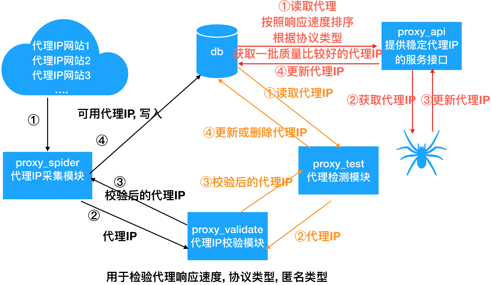

## 2. 代理池的设计

    
- 代理池分五大核心模块:
    - 数据库模块: 实现对代理IP的增删改查操作
      - 这里使用MongoDB来存储代理IP
    - 代理IP的检测模块:
       - 测试代理速度, 支持的协议以及匿名程度 ,原因: 网站上所标注的协议类型和匿名类型是不准确的
       - 这里使用httpbin.org进行检测
    - 爬虫模块: 采集代理IP
      - 从代理IP网站上采集代理IP 
      - 进行校验(获取代理响应速度, 协议类型, 匿名类型), 
      - 把可用代理IP存储到数据库中
    - 检验模块: 检查代理的可用性,然后进行处理
        - 从数据库读取所有的代理IP
        - 对代理IP进行逐一检测, 可用开启多个协程, 以提高检测速度
        - 根据检测结果对代理IP进行更新
    - 代理IP服务接口
        - 根据协议类型随机获取高质量的代理IP
        - 根据代理IP, 附加不可用域名; 有些代理IP在这个域名下不能用在别的域名下可用.

- 代理池的其他模块
  - 程序启动入口: `main.py`
    - 代理池提供一个统一的启动入口
  - 数据模型: `domain.py`:
    - 代理IP的数据模型 
  - 工具模块:
    - 日志模块: 用于记录日志信息
    - http模块: 用于获取随机User-Agent的请求头
  - 配置文件: `settings.py`
    - 用于配置日志, 启动的爬虫, 启用的代理IP检验类 等.

- 代理池的项目结构

        -- IPProxyPool
            -- db
              -- __init__.py
              -- mongo_pool.py
            -- proxy_validate
                -- __init__.py
                -- httpbin_validator.py
            -- proxy_spider
                -- __init__.py
                -- base_spider.py
                -- proxy_spiders.py
                -- run_spiders.py
            -- utils
                -- __init__.py
                -- http.py
                -- log.py
            -- proxy_test.py
            -- proxy_api.py
            -- main.py
            -- domain.py
            -- settings.py
